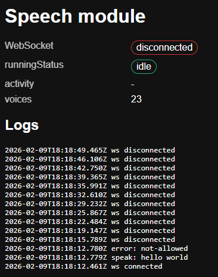

# User doc

User must allow explicitely his browser to allow play sound even if there is no human gesture (this is a browser security spec from W3C)

otherwise, you will got the error `error: not allowed` as shown below (snapshot of the SPA running in the `chrome` browser):



click on the button in the url bar:


in the menu acces to **`site parameters`**, and select:

```
sound: authorize
```

and not on `on demand`, or `automatically`


